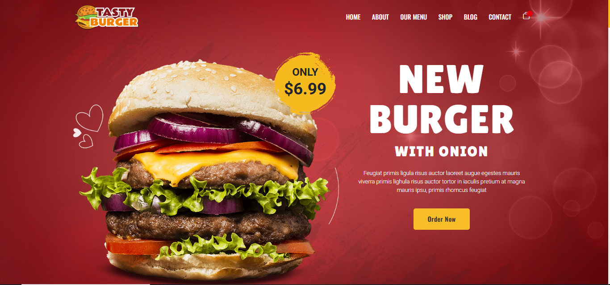
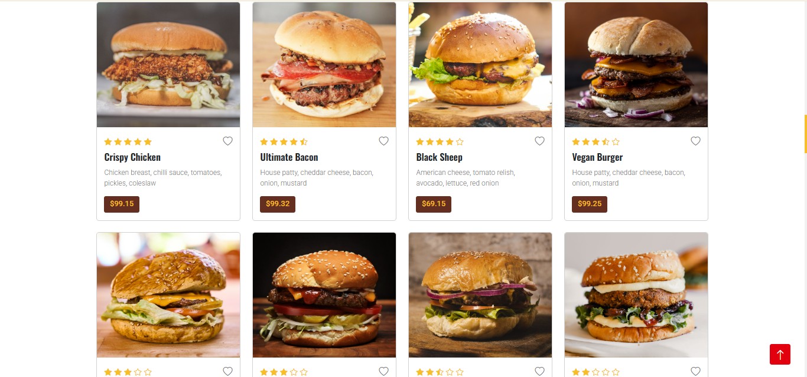
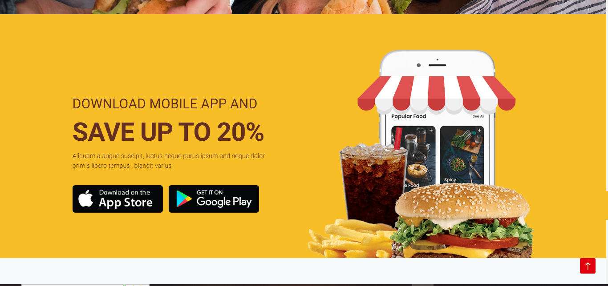

<h1 align="center"> Food Delivery - Burger Website (Frontend)</h1>

<h3 align="center">It's a React.js E-commerce web application with all the major functionalities</h3>

<br />

<h2 align="center">🖥️ Tech Stack</h2>


<h4 align="center">Frontend:</h4>

<p align="center">
  
  
  
  
  
  
  
</p>


<h4 align="center">Payment Gateway:</h4>

<p align="center">
  
</p>


<p align="center">
  <br />&#10023;
  <a href="https://github.com/ECommerce-Zone/Nike-Clone/Nike-Clone/issues">Report Bug</a> &#10023;
  <a href="#Getting-Started">Getting Started</a> &#10023; 
  <a href="#Install">Installing</a> &#10023;
  <a href="#Contact">Author</a> &#10023;
</p>


Food-Delivery Application is React.js e-commerce web application that allows you to order online food  It has a variety of types of food , just visit the menu page and you will see all the food items, apply filters as per your need and in just a few clicks you can buy any products from the website. This project is just for educational purpose.








<br />

## Screens ( All screens are responsive along with Dark Mode)
- Homepage / Landing Page
- Food Menu Page
- Here you can download throught PlayStore


<br />


## 🚀 Features
-
- My Orders Section for details of all ordered item
- Wishlist Add and Remove Items
- Cart Add and Remove Items 
- Cart Update Quantities 
- Address Management
- Order Summary
- Coupons provided for discount
- Razorpay Payment Gateway
- Darkmode available

<br />


<br />


## Getting Started

This project was built using React, Redux,  HTML, CSS, JavaScript, Rest API,and RazorPay integration. It is an e-commerce web application and for running on your local environment you should follow these guidelines.


### Prerequisites

- NPM
- Node JS
- MongoDB

### Setup


The project repository can be found in [GitHub link](https://github.com/daisycoder345/full-stack-task-management-app) or just clone the project using this command.


```
Using HTTPS

# git clone https://github.com/daisycoder345/full-stack-task-management-app
```


## Install

Install NPM

Check that you have node and npm installed

To check if you have Node.js installed, run this command in your terminal:


```
node -v
```

To confirm that you have npm installed you can run this command in your terminal:


```
npm -v
```

To confirm that you have MongoDB installed you can run this command in your terminal:


```
mongo -v
```


To install all the dependences of the project, run the following command:


```
cd client

npm install

cd ../

cd server

npm install
```


To run the application got to the client folder and run the following command:

```
npm start
```


### Tools used on this project

- Visual Studio Code
- Vite-JS template
- MongoDB compass
- Razorpay Dashboard to monitor payments

<br />


## Show your support

Give a ⭐️ if you like this project!
